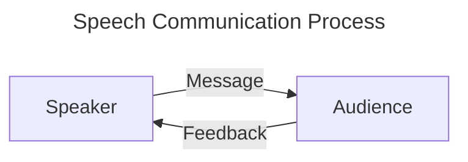

# Syllabus
## Assignments
- Homework will only be accepted at the **beginning** of class
- All assignments must be typed
- To receive homework points, you must complete ***EVERY ASSIGNMENT***
### Point Distribution
| Assignment        | Points |
| ----------------- | ------ |
| I AM              | 30     |
| Homework          | 180    |
| Cultural Artifact | 100    |
| Impromptu         | 50     |
| Text Review       | 100    |
| Persuasion        | 150    |
| Midterm           | 150    |
| Final             | 100    |
| Participation     | 240    |
| Total             | 1100   |
# 6/16
## What is communication?
- Communication
	- The exchange of language
- Language
	- Arbitrary *Random* showed symbol system

## Speech comm process
Speaker
Audience 

What gets the message from one person to another is the **Channel of Communication**.
Not all messages sent can be received.
### Describing the process
The speaker sends a message through a channel 
**Channel** is the **means of a communication** 
to an audience who responds with feedback 
which can be met with interference at either the *Message* or *Feedback*, either *Physical* or *Psychological*.

## What is the goal of Public Speaking

### Goals of Public Speaking
1. To inform
2. To Persuade
3. To Entertain
4. To Inspire
### Types of speeches
1. Informative
	1. Description
	2. Explanation
	3. Demonstration
2. Persuasive 
	1. Attitude
	2. Believe
	3. Behavior
	4. Policy
3. Testimonial *Inspire*
	1. Place of God
	2. TED Talk
	3. Education
	4. Locker Room
	5. Courtroom
	6. Adverts
4. Special Occasion *Entertain*
	1. Toast
	2. Commemoration
	3. Eulogy 
	4. Awards Expectancy / Presentation

As long as there is 2 people there is communication going on 
As the intimacy increases the size decreases.

**INTIMACY**
- Communication within the selves **intrapersonal relationship**
- **Interpersonal Relationships** Are relationships with 2 people
- Groups 
- Organization
- Public Speaking
- Mass Communication 
**SIZE**

Writing a speech 
- Brainstorm
- Pick a good topic
	- Occasion
	- What is my Goal?
	- What is my audience?
	- What are my Requirements
	- What are my Restraints
	- Brainstorm Generate a List
	- Evaluate list *Have enough Info*
		- Am I interested 
		- Are they interested
			- Is it relevant
			- is it controversial
			- Is it sexy is it current 
	- Pick 
	- **Follow through and commit**

# 6/17
## Thesis 
A **Thesis** is an argument
**The Thesis** is a position that an author takes on an arguable point.

## Library Example
### Example Thesis 
Library Research tools are vital

### List Items
- Book
- Computer
- Software
- Articles
- Librarian
- DVD
- Magazine
- Interviews
- Photos
- CDs
- YouTube
- Bathrooms
- Printer
- Chromebook

- Brainstorm
- Evaluate and Remove unnecessary 
- Categorize and Group items together

Introduction
1. Hook
2. Thesis
3. Preview
	1. Main Point 1 *Books*
		1. Gen Circulation
		2. Reference
		3. EBooks
	2. Main Point 2 *Periodicals*
		1. Newspapers
		2. Magazines
		3. Journals
		4. Gov. Docs.
	3. Main Point 3 *Computer*
		1. Search Engine
		2. Database
	4. Conclusion
		1. Review 
			1. Main Point 1
			2. Main Point 2
			3. Main Point 3
		2. Thesis
		3. Bang!

## I Ams
SANTA ANA
https://www.amtrak.com/stations/sna
s-9qh0n073qp-santaana
SNA
GET https://transit.land/api/v2/rest/stops/1451807603/departures
